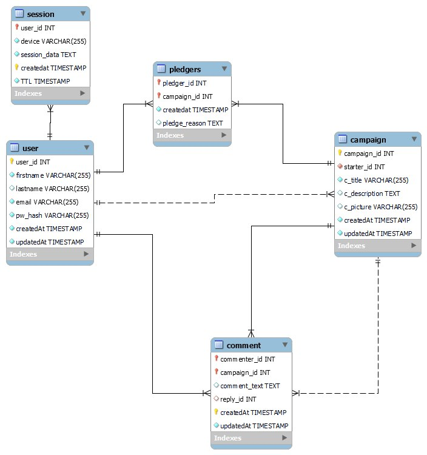

# SupportMe
 A smaller clone of change.org for learning purposes

# Endpoints

##  1. Register

```API
POST /register
```

### Request

| Attribute  |      Type     |  Required |  Description |
|:----------:|:-------------:|:------:|:------:|
| `firstname` |  String  | Yes | First name |
| `lastname` |     String    |   No | Last name |
| `email` |  String  |    Yes | Email |
| `password` |  String  |    Yes| Password |

```json

{
"firstname":"sunset boulevard",
"lastname":"test",
"email":"mainuser@lol.com",
"password":1234 
}

```

### Response
```json
{"message":"Successfully registered"}
```

## 2. Login
```API
POST /login
```

### Request

| Attribute  |      Type     |  Required |  Description |
|:----------:|:-------------:|:------:|:------:|
| `email` |  String  | Yes | Registered email |
| `password` |     String    |   Yes | Password |


```json

{
"email":"mainuser@lol.com",
"password":1234 
}
```

### Response
```json
{
"message":"Login successful",
"token":"JWT-TOKEN"
}
```

# To Do List
- [x] Registration Controller
- [x] Login Controller
- [x] Authentication System using JWT
- [ ] Obtain Device header
- [x] Database DAO
- [x] Create Custom Router Class
- [ ] Account for malformed json type i.e missing email and password or other keys for register and login controllers
- [ ] authenticate does not differentiate no user/wrongg pass
- [ ] consider what if client enters data w/not matching id
- [ ] Retract Support from campaign
    1 Unpledge(PledgerID,CampaignID)
- [ ] Self User profile
    1. GetCampaigns()
    2. GetUserInfo()
- [ ] Campaign Page
    1. GetCampaignInfo()
    2. GetComments()
    3. CountTotalPledges()
- [ ] Comment on campaign
   1. CommentOnCampaign()
   1. ReplyToComment()
- [ ] Create SupportMe Campaign
    1. ValidateFields()
    2. CheckCampaignExist()
- [ ] Delete SupportMe Campaign
    1. DeleteCampaign()
- [ ] Pledge Support for Campaign
    1. Pledge(pledgerID,campaignID)
- [x] Search for Campaign
    1. By ID
    2. By Name (simple search with wild card)


# Installation
1. Clone the repository 
```bash
git clone https://github.com/neilscallywag/SupportMe.git
```
2. Make sure you have Composer installed. Move to the directory where you have composer.json with the command prompt and run the following command:
```bash
composer install
```


# Unfixed errors

 ```php  
<b>Fatal error</b>:  Uncaught TypeError: Exception::__construct(): Argument #2 ($code) must be of type int, string given in C:\xampp\htdocs\vendor\klein\klein\src\Klein\Klein.php:954
Stack trace:
#0 C:\xampp\htdocs\vendor\klein\klein\src\Klein\Klein.php(954): Exception-&gt;__construct('SQLSTATE[HY093]...', 'HY093', Object(PDOException))
#1 C:\xampp\htdocs\vendor\klein\klein\src\Klein\Klein.php(645): Klein\Klein-&gt;error(Object(PDOException))
#2 C:\xampp\htdocs\index.php(68): Klein\Klein-&gt;dispatch()
#3 {main}
  thrown in <b>C:\xampp\htdocs\vendor\klein\klein\src\Klein\Klein.php</b> on line <b>954</b><br />
```

# Database Entity Relationship Schema



